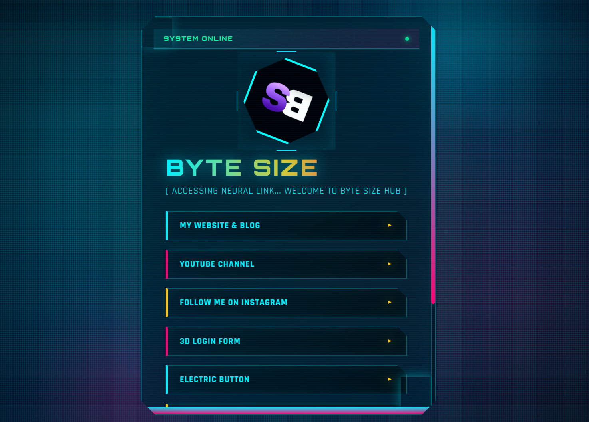

# BYTE SIZE — Link Landing Page

A modern, responsive, and polished link landing page (Link Tree style) with a 3D glass card, animated background, and smooth pointer interactions. Designed to look great on desktop, tablets (iPad), and mobile devices.

---

## Features

- Eye-catching 3D glass-style card with depth using CSS transforms.
- Animated blurred background blobs for subtle visual interest (hidden on small screens for performance).
- Pointer-based tilt interaction on devices with a fine pointer (desktop mouse). Disabled on touch devices and when `prefers-reduced-motion` is enabled.
- Fluid, responsive typography and layout using `clamp()` and CSS breakpoints for consistent sizing across devices.
- Accessible focus styles and keyboard-friendly interactions.
- Lightweight: pure HTML, CSS, and vanilla JavaScript — no build step required.

---

## Files

- `index.html` — Main markup file.
- `index.css` — Styling (responsive, 3D effects, animations).
- `index.js` — Pointer tilt interactions, accessibility helpers.
- `main image.png` — Profile image used on the card.

---

## Quick start 
# 🚀 BYTE SIZE — My Personal Link-in-Bio Page



A clean, modern, and fully responsive link-in-bio page built with HTML, CSS, and a touch of JavaScript. This project serves as a central hub for your important links and is designed to be easily customized and hosted for free via GitHub Pages.

---

## ✨ Features

- Clean & modern UI with a 3D glass card and subtle motion.
- Fully responsive: looks great on phones, tablets, and desktops.
- Interactive hover and pointer-based tilt on non-touch devices (disabled on small screens and for reduced motion).
- Lightweight and dependency-free — pure HTML, CSS, and vanilla JavaScript.

---

## 💻 Tech Stack

Built with core web technologies:


---

## Quick start (Windows / PowerShell)

Open https://bytesize-del.github.io/LINK-TREE/ in your browser.
---

## How to Customize

- Colors: edit CSS variables at the top of `index.css` (`--accent-a`, `--accent-b`, `--bg1`).
- Profile image: replace `main image.png` or update the `src` in `index.html`.
- Links: update the `<a>` tags inside `.links-container` with your URLs and text.
- Tilt intensity: edit the rotation multiplier in `index.js` to adjust tilt strength.

Example snippet:

```html

<h1 class="profile-name">@yourusername</h1>
<p class="bio">Short bio about you.</p>

<a href="https://your-link.com" target="_blank" rel="noopener" class="link-button">Your Link Title</a>
```

---

## Accessibility & Responsiveness

- Focus-visible styles for keyboard users.
- Tilt respects `prefers-reduced-motion` and is disabled on touch/small screens.
- Buttons use touch-friendly sizes (min-height >= 44px).

---

## License

This project is provided under the MIT License. Add a `LICENSE` file to include the full license text.

---

## Connect

MY profiles:

[](http://www.youtube.com/@ByteSize-01)
[](https://www.instagram.com/_byte_size_del/?hl=en)
---

If you'd like, I can:

- Add SVG icons to the link buttons and update the README with usage.
- Create a `package.json` and an `npm start` script for easy local testing.
- Add a generated `screenshot.png` to the repo.

Tell me which you'd like next and I'll implement it.

